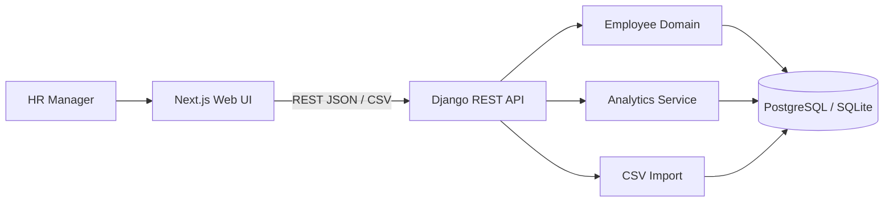

# Architecture & Design Notes

## System context

## Why a modular monolith
The data size is 10,000 employees, not millions of events per second. A single Django application with clear modules minimizes deployment and consistency complexity while preserving clean boundaries. If future scale or teams justify extraction, analytics/import are already separated at the module/API level.

## Data model

### Employee
- Stable business key `employee_id` plus database UUID.
- Identity/work attributes: name, email, department, title/level, country, hire date.
- Compensation: local annual salary, ISO-like currency code, FX snapshot (`USD per 1 unit of local currency`), normalized annual salary USD.
- Audit timestamps.

### SalaryChange
Immutable change record with employee, previous/new local salary, currency, FX snapshot, normalized USD value, effective date, and optional reason.

## Money correctness
Use `DecimalField` throughout; never binary floating point for salary amounts. Cross-country analytics query `annual_salary_usd`, not local salary. Conversion is centralized in `employees/services.py` to avoid duplicated business rules.

## API boundaries
`EmployeeViewSet` owns employee CRUD, filtering, import, and salary history. `analytics` endpoints are read-only and use database aggregation where possible. Median currently reads one normalized salary column and computes an exact median in-process; 10,000 decimals is deliberately simple and bounded. At materially larger scale, move to PostgreSQL percentile functions/materialized reporting tables.

## Failure behavior
- Model/serializer validation rejects invalid money/currency.
- CSV import validates all rows first; if any row fails, the transaction imports nothing.
- Duplicate employee IDs/emails inside the file or database are reported with row numbers.
- API returns explicit 4xx validation details rather than silent coercion.

## Security posture
Take-home deployment uses synthetic data. Production hardening requires SSO, HR-scoped RBAC, encrypted secrets, audit/event retention policy, secure backups, rate limiting, observability, and privacy/access reviews. These concerns are intentionally documented rather than superficially simulated.
